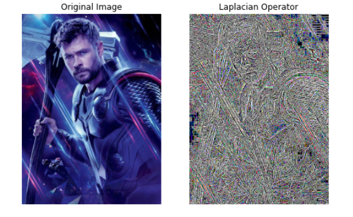

# Implementation-of-Filters
## Aim:
To implement filters for smoothing and sharpening the images in the spatial domain.

## Software Required:
Anaconda - Python 3.7

## Algorithm:
### Step1:
</br>Import cv2, matplotlib.py libraries and read the saved images using cv2.imread().
</br> 

### Step2:
</br>Convert the saved BGR image to RGB using cvtColor().
</br> 

### Step3:
</br>By using the following filters for image smoothing:filter2D(src, ddepth, kernel), Box filter,Weighted Average filter,GaussianBlur(src, ksize, sigmaX[, dst[, sigmaY[, borderType]]]), medianBlur(src, ksize),and for image sharpening:Laplacian Kernel,Laplacian Operator.
</br> 

### Step4:
</br>Apply the filters using cv2.filter2D() for each respective filters.
</br> 

### Step5:
</br>Plot the images of the original one and the filtered one using plt.figure() and cv2.imshow().
</br> 
```
## Program:

### Developed By   : DHANUSH S
### Register Number: 212221230020

import cv2
import matplotlib.pyplot as plt
import numpy as np
image1=cv2.imread("Thor-1.jpg")
image2=cv2.cvtColor(image1,cv2.COLOR_BGR2RGB)
```
### 1. Smoothing Filters

i) Using Averaging Filter
```Python
kernel=np.ones((11,11),np.float32)/121
image3=cv2.filter2D(image2,-1,kernel)
plt.figure(figsize=(8,8))
plt.subplot(1,2,1)
plt.imshow(image2)
plt.title("Original Image")
plt.axis("off")
plt.subplot(1,2,2)
plt.imshow(image3)
plt.title("Average Filter Image")
plt.axis("off")
plt.show()


```
ii) Using Weighted Averaging Filter
```Python
kernel2 = np.array([[1,2,1],[2,4,2],[1,2,1]])/16
weighted_filter = cv2.filter2D(original_image,-1,kernel2)
plt.figure(figsize = (9,9))
plt.subplot(1,2,1)
plt.imshow(original_image)
plt.title("Original")
plt.axis("off")
plt.subplot(1,2,2)
plt.imshow(weighted_filter)
plt.title("Filtered")
plt.axis("off")


```
iii) Using Gaussian Filter
```Python

gaussian_blur = cv2.GaussianBlur(src = original_image, ksize = (11,11), sigmaX=0, sigmaY=0)
plt.figure(figsize = (9,9))
plt.subplot(1,2,1)
plt.imshow(original_image)
plt.title("Original")
plt.axis("off")
plt.subplot(1,2,2)
plt.imshow(gaussian_blur)
plt.title("Filtered")
plt.axis("off")


```

iv) Using Median Filter
```Python

median = cv2.medianBlur(src=original_image,ksize = 11)
plt.figure(figsize = (9,9))
plt.subplot(1,2,1)
plt.imshow(original_image)
plt.title("Original")
plt.axis("off")
plt.subplot(1,2,2)
plt.imshow(median)
plt.title("Filtered (Median)")
plt.axis("off")


```

### 2. Sharpening Filters
i) Using Laplacian Kernal
```Python

kernel3 = np.array([[0,1,0],[1,-4,1],[0,1,0]])
laplacian_kernel = cv2.filter2D(original_image,-1,kernel3)
plt.figure(figsize = (9,9))
plt.subplot(1,2,1)
plt.imshow(original_image)
plt.title("Original")
plt.axis("off")
plt.subplot(1,2,2)
plt.imshow(laplacian_kernel)
plt.title("Filtered (Laplacian Kernel)")
plt.axis("off")


```
ii) Using Laplacian Operator
```Python


laplacian_operator = cv2.Laplacian(original_image,cv2.CV_64F)
plt.figure(figsize = (9,9))
plt.subplot(1,2,1)
plt.imshow(original_image)
plt.title("Original")
plt.axis("off")
plt.subplot(1,2,2)
plt.imshow(laplacian_operator)
plt.title("Filtered (Laplacian Operator)")
plt.axis("off")


```

## OUTPUT:
### 1. Smoothing Filters
</br>

i) Using Averaging Filter
</br>
</br>
</br>


ii) Using Weighted Averaging Filter
</br>
</br>
</br>


iii) Using Gaussian Filter
</br>
</br>
</br>
</br>
</br>

iv) Using Median Filter
</br>
</br>
</br>


### 2. Sharpening Filters
</br>

i) Using Laplacian Kernal
</br>
</br>
</br>
</br>

ii) Using Laplacian Operator
</br>
</br>
</br>

## Result:
Thus the filters are designed for smoothing and sharpening the images in the spatial domain.
